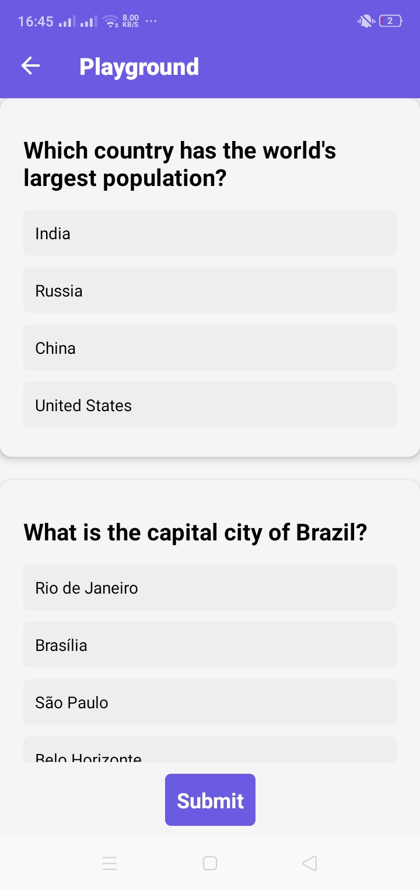
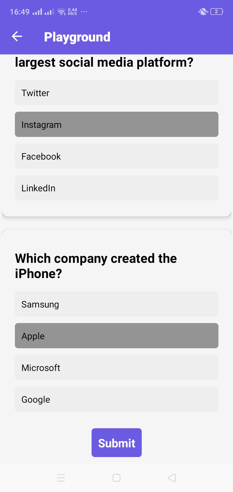

# QuizApp 👩‍💻

A simple Quiz App using Firebase and React Native Expo. This quiz include 6 subject. 

## Brief
- Create an quiz app, which consists of 6 subject, and in 1 subject matter consists of 10 questions.
- Must be able to see score at the end of the quiz, as well as see what answers we gave and if they were correct.

## Screenshots

    
    

    
    

